# 自研 CRM 管理系统

一个可直接运行的销售 CRM：FastAPI + SQLAlchemy Core 后端，
Vite + React + TypeScript 管理前端，行级数据权限、写审计与写幂等。

它同时是 **AI x CRM 能力层**（`D:\codex`）的数据底座：
AI 层只通过下面那套 REST 契约读写 CRM，两边的进程与部署完全独立。

## 界面预览

截图来自本机实跑（`npm run dev` + sqlite 演示数据，管理员视角，1440x900），
每个栏目一张，原图放在 `docs/images/`。

### 登录

用 CRM 账号登录（首次启动的管理员由 `CRM_BOOTSTRAP_ADMIN_*` 决定），
令牌存在浏览器本地，后续请求带 `Authorization: Bearer`。

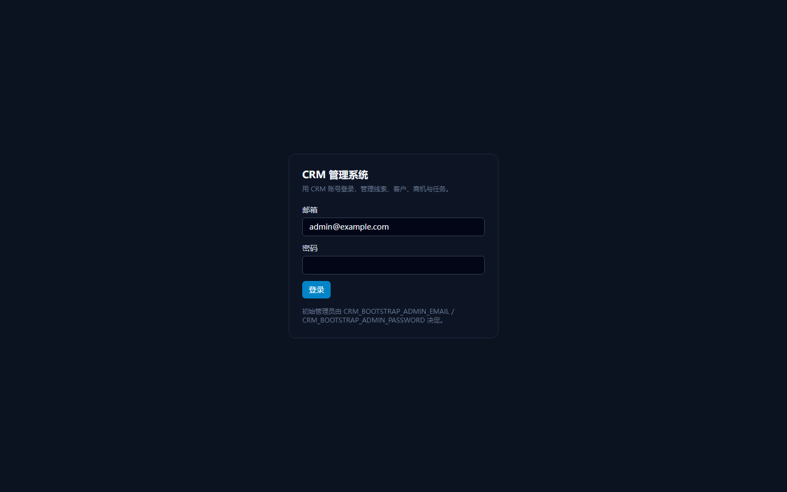

### 仪表盘

对象计数、管道金额（未关闭商机合计）、赢单金额、待办任务，外加商机阶段分布与最近活动。

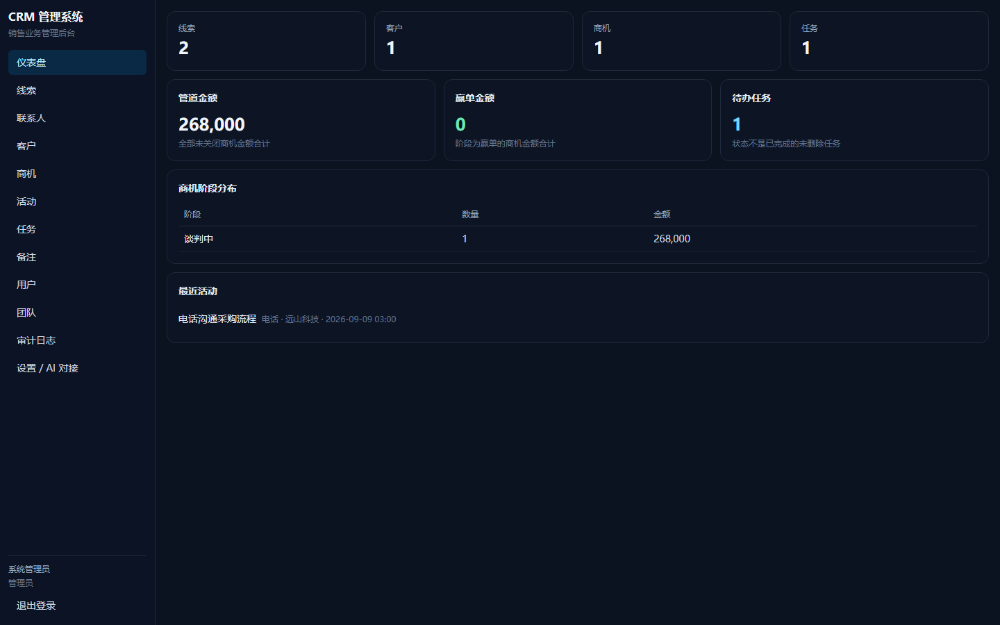

### 线索

线索池：公司、联系人、邮箱、来源、阶段。列表页统一带关键词过滤、属性下拉过滤、
分页与「显示已删除」开关，表格列由 `contract.py` 推导。

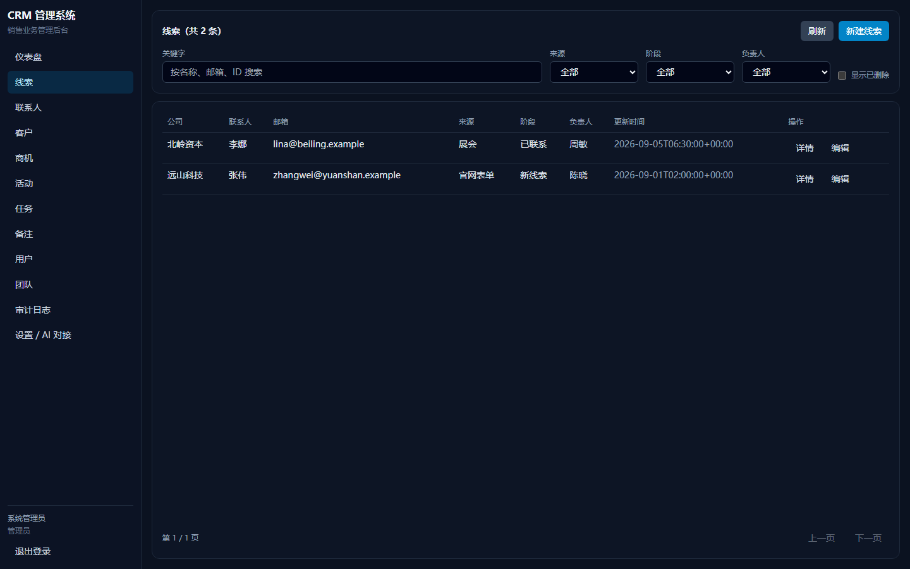

### 联系人

联系人：姓名、所属客户、职位、邮箱、电话。

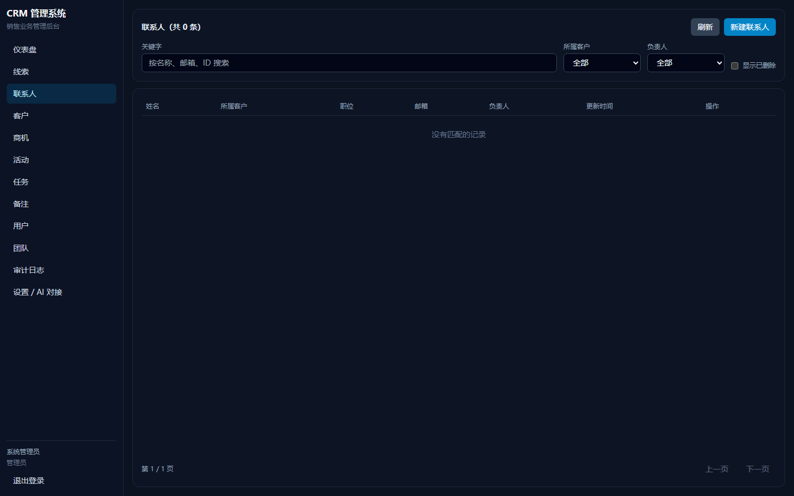

### 客户

客户主数据：客户名称、行业、规模、区域。

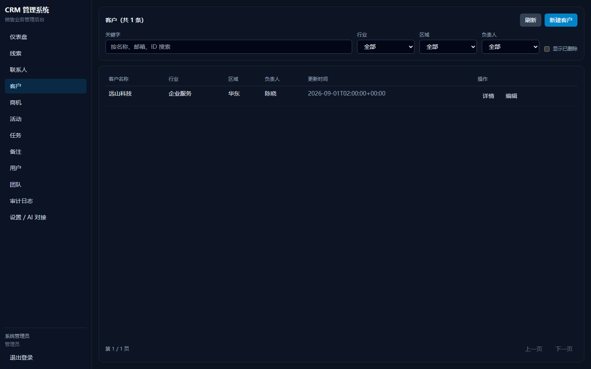

### 商机

商机列表：所属客户、金额与币种、阶段、预计成交日。

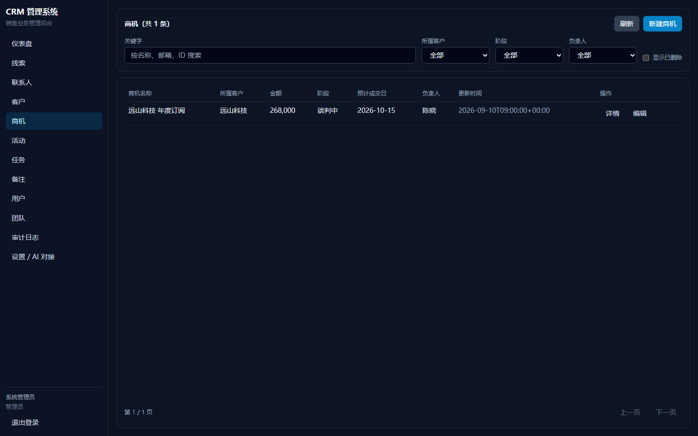

### 商机详情

单据详情：版本号（乐观锁）、负责人与归属团队，以及挂在本商机下的关联记录；
页内可以直接新建关联记录。

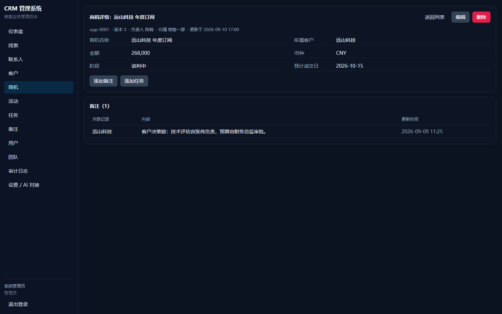

### 新建商机

新建表单由契约推导：必填校验、枚举下拉（阶段），外键（所属客户 / 负责人）选项从接口拉。

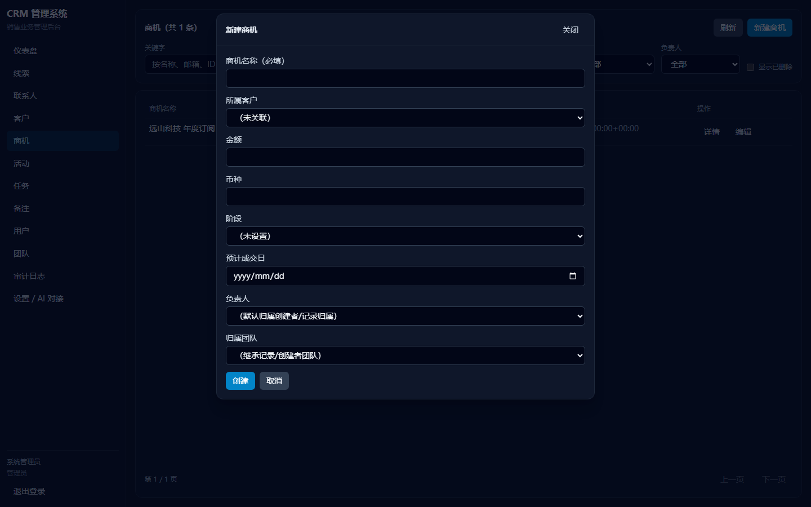

### 活动

活动记录（电话 / 邮件 / 会议 / 拜访 / 记录）挂在关联记录上，含发生时间与内容。

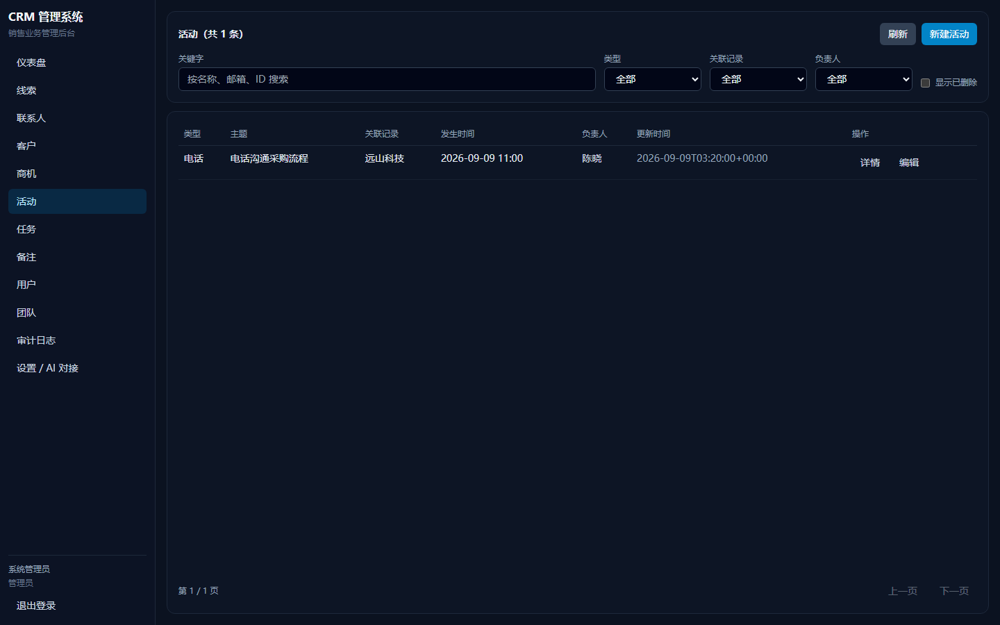

### 任务

待办任务：任务、截止时间、关联记录、优先级（低 / 中 / 高）与状态（进行中 / 已完成）。

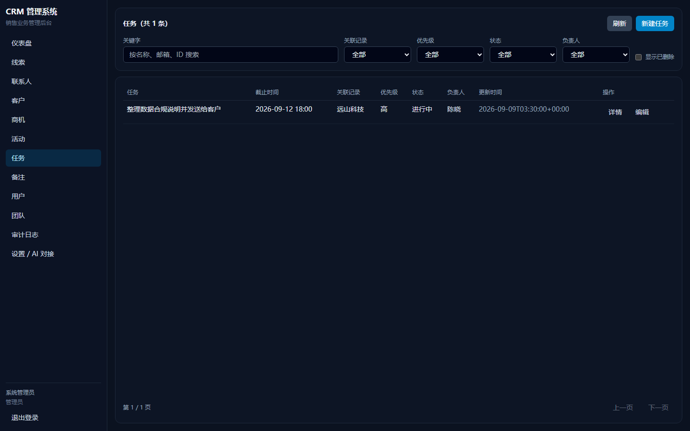

### 备注

备注沉淀在关联记录上，可作为跟进记录长期留存。

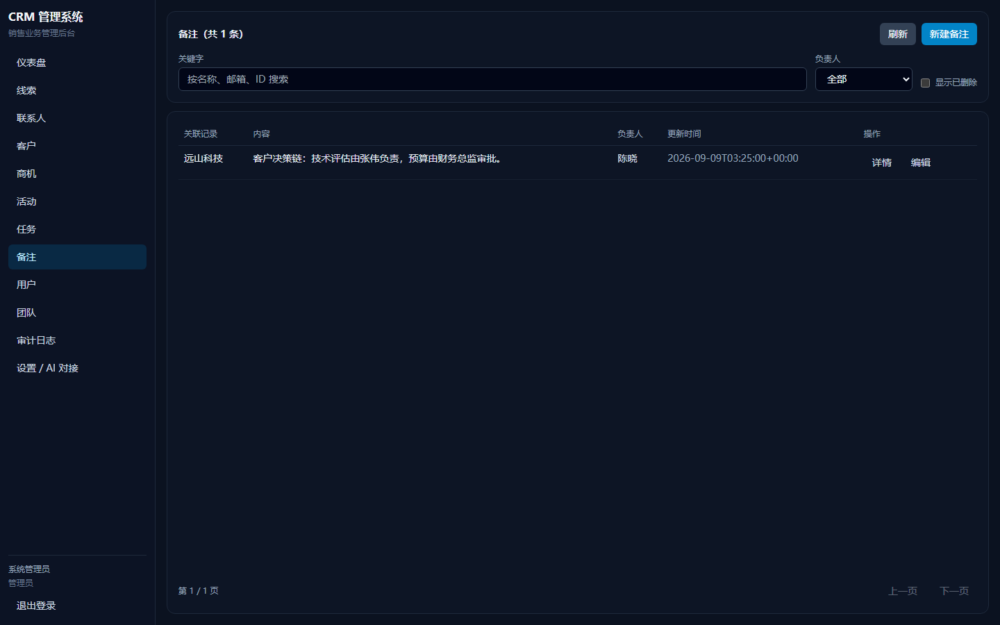

### 用户

用户与角色（admin 管理员 / manager 销售主管 / rep 销售）、所属团队与启停用状态。
仅管理员可见。

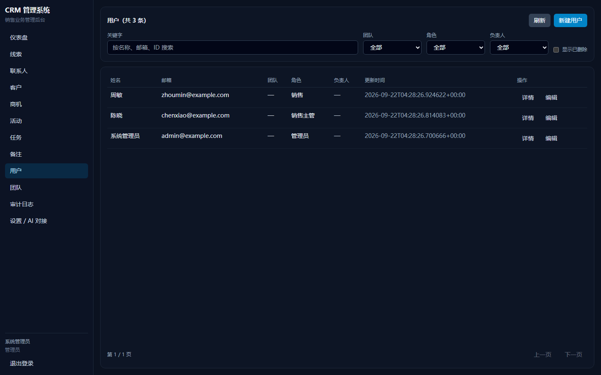

### 团队

团队与成员；行级权限按团队划分可见范围。

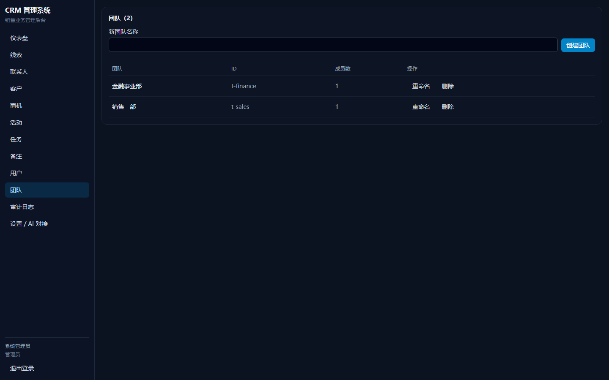

### 审计日志

每次写操作的留痕：时间、来源（human / ai）、操作者、对象与记录、方法、请求路径、
修改前后的值、幂等键。仅管理员可见，AI 写回记成 `source=ai`、`actor_kind=service`。

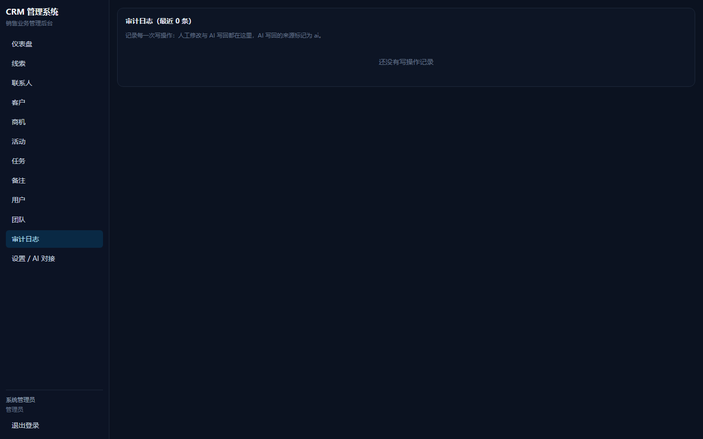

### 设置 / AI 对接

当前账号与改密码，以及把本系统接进 AI 能力层（`D:\codex`）所需的接口地址、
`.env` 片段与只读探测命令。

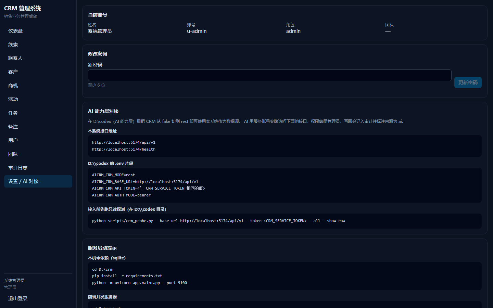

## 目录结构

```text
app/
  contract.py         对象与字段元数据的唯一来源（改字段名等于改对接契约）
  core/               配置、JSON 日志、密码与自签令牌
  adapters/sql.py     存储层：建表、CRUD、行级权限、游标分页、审计、幂等
  services/records.py 用例层：幂等回放、审计落库、时间解析
  api/                路由、请求响应模型、身份依赖
  seed.py             演示数据（ID 与 AI 层 fake 模式保持一致）
  container.py        依赖装配与初始化
  main.py             FastAPI 入口，附带前端静态托管
web/                  Vite + React + TypeScript + Tailwind 管理前端
tests/                标准库 unittest 测试集（sqlite 临时库 + TestClient）
docs/runbook.md       全栈启动手册（含 AI 能力层与向量模型）
```

## 快速开始

```powershell
cd D:\crm
pip install -r requirements.txt
copy .env.example .env

# 默认 sqlite，零外部依赖，首次启动自动建表 + 演示数据 + 管理员
python -m uvicorn app.main:app --host 127.0.0.1 --port 9100
```

- 健康检查：`http://127.0.0.1:9100/health`
- 接口文档：`http://127.0.0.1:9100/docs`
- 管理界面：`http://127.0.0.1:9100`（需要先构建前端，见下）

前端开发形态（热更新，代理到 9100）：

```powershell
cd D:\crm\web
npm install
npm run dev        # http://127.0.0.1:5174
```

前端生产形态（由 FastAPI 或容器托管）：

```powershell
cd D:\crm\web
npm run build      # 产出 web/dist
```

Postgres 形态与容器编排见 `docs/runbook.md`。

## 与 AI 能力层的对接契约

### 接口

| 方法 | 路径 | 说明 |
| --- | --- | --- |
| GET | `/api/v1/{object_type}` | 列表，支持 `cursor` / `limit` / `updated_since` |
| GET | `/api/v1/{object_type}/{id}` | 单条 |
| POST | `/api/v1/{object_type}` | 新建 |
| PATCH | `/api/v1/{object_type}/{id}` | 局部更新 |
| DELETE | `/api/v1/{object_type}/{id}` | 软删除 |

列表统一返回 `{"data": [...], "next_cursor": ..., "total": N}`，
单条与写操作统一返回 `{"data": {...}}`。

### 鉴权

AI 层用 `Authorization: Bearer <CRM_SERVICE_TOKEN>`，服务账号等同管理员，
并可用 `X-Actor-Id` / `X-Actor-Team-Ids` 声明真实操作者（只影响审计归因与写入归属）。
人工用户走 `POST /api/auth/login` 换自签令牌。

### 对象与字段

| 对象 | 业务字段 |
| --- | --- |
| `leads` | company, contact, email, phone, source, stage |
| `contacts` | name, account_id, title, email, phone |
| `accounts` | name, industry, scale, region |
| `opportunities` | name, account_id, amount, currency, stage, expected_close_date |
| `activities` | kind, subject, content, target_id, occurred_at |
| `tasks` | subject, due_at, target_id, priority |
| `notes` | target_id, content |
| `users` | name, email, team_ids |

每条记录另有公共列：`id`、`version`、`updated_at`、`owner_id`、`team_ids`。

约定：

- 字段名就是契约，不要在 CRM 侧改名；改了 AI 层会把值收进 `_extra`。
- 未声明的字段不会被丢弃，会原样透传（AI 侧收进 `_extra`）。
- 内部列 `tenant_id` / `team_id` / `created_by` / `deleted_at` 不出现在出参里，
  归属只通过 `team_ids` 数组暴露。
- 写入时 `team_ids` 与 `team_id` 都接受，方便「读到什么就写回什么」。

### 写幂等与冲突

- 写接口接受 `Idempotency-Key`：同 key 同请求体直接回放首次响应，不再写库、不重复记审计；
  同 key 不同请求体返回 409。
- `PATCH` / `DELETE` 接受可选 `version`，与当前版本不符返回 409（乐观锁）。
- 可重试状态码沿用 AI 层约定：408 / 425 / 429 / 5xx 时安全重试。

### 状态码

`400` 入参非法（缺必填、枚举越界、类型不符）、`401` 凭证缺失或失效、
`403` 记录可见但无写权限、`404` 记录不存在或不可见（两者不区分，避免探测）、
`409` 版本冲突或幂等键复用。

## 权限模型

| 角色 | 可见 | 可写 |
| --- | --- | --- |
| `admin` / 服务账号 | 全部 | 全部 |
| `manager` | 本团队 | 本团队 |
| `rep` | 本人 + 本团队 | 仅本人 |

团队与用户由管理员在界面维护；记录单团队归属。
可见但无写权限返回 403，不可见返回 404。

## 审计

每次写操作（人工与 AI）都落一条审计：时间、来源（`human` / `ai`）、操作者、
对象与记录 ID、方法、请求路径、修改前后的值、幂等键。
审计只有管理员能查，界面在「审计」页。

## 测试

```powershell
cd D:\crm
python -X utf8 -m unittest discover -s tests -t .
```

108 条用例，覆盖契约字段形状、游标分页、`updated_since`、
写幂等回放与冲突、版本冲突、软删除、三角色行级权限、
鉴权与令牌失效、写审计与种子数据完整性。
测试使用临时 sqlite 库，不依赖 Postgres 或任何外部服务。

## 配置

全部配置以 `CRM_` 为前缀，见 `.env.example`。常用项：

| 变量 | 默认 | 说明 |
| --- | --- | --- |
| `CRM_STORAGE` | `sqlite` | `sqlite` 或 `postgres` |
| `CRM_SQLITE_PATH` | `data/crm.sqlite3` | sqlite 文件位置 |
| `CRM_DATABASE_URL` | — | postgres 连接串 |
| `CRM_SERVICE_TOKEN` | `dev-service-token` | AI 层用的服务令牌 |
| `CRM_SECRET_KEY` | `dev-only-change-me` | 登录令牌签名密钥 |
| `CRM_SERVE_WEB` | `true` | 是否托管 `web/dist` |
| `CRM_SEED_DEMO` | `true` | 是否写入演示数据 |

## 未验证项

本机只验证了 sqlite 形态、unittest 套件与前端类型检查/构建。
Postgres 适配、`docker compose` 编排、容器镜像构建均**未实测**，
相关内容见 `docs/runbook.md` 第 8 节。
